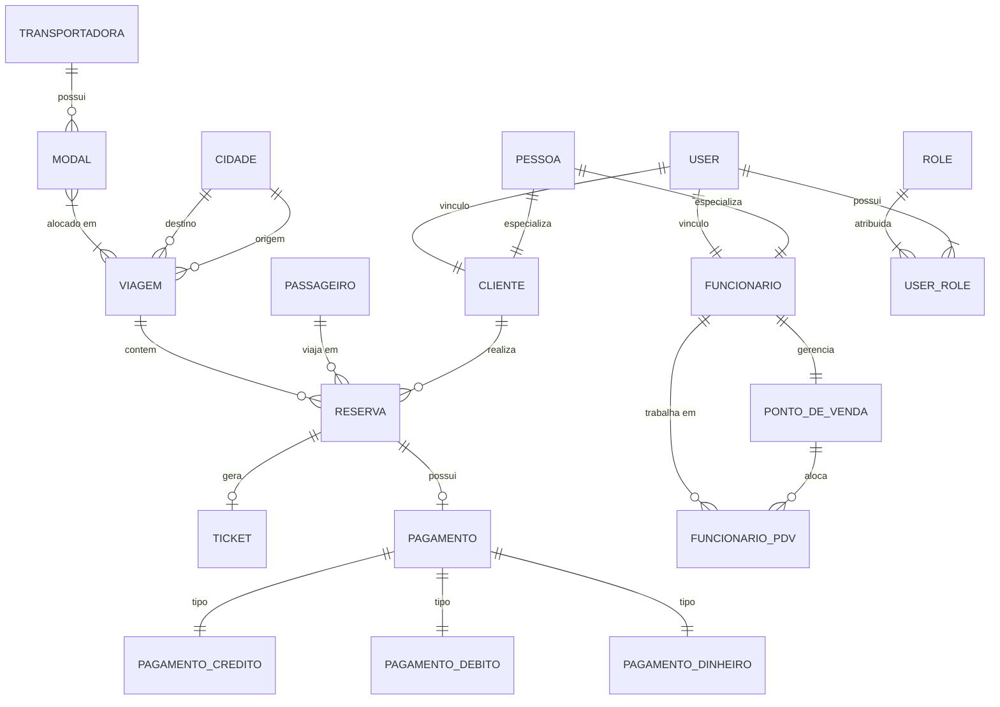

# VVV (Vai & Volta Viagens) — Sistema de Controle e Vendas de Passagens (SCVP)

[](https://www.oracle.com/java/)
[](https://spring.io/projects/spring-boot)
[](https://www.postgresql.org/)
[](https://flywaydb.org/)
[](https://www.docker.com/)

Este repositório contém a implementação do **Sistema de Controle e Vendas de Passagens (SCVP)** para a agência **Vai&Volta Viagens (VVV)**. O projeto foi desenvolvido como um estudo de caso prático para a disciplina de **Análise e Modelagem de Sistemas** do curso de **Sistemas de Informação (SI)** no **CEFET/RJ**.

O sistema gerencia de forma robusta a emissão de bilhetes de viagens terrestres e aéreas, o controle de capacidade dos modais de transporte, as regras de cobrança de tarifas com descontos e juros, a alocação de funcionários em pontos de venda físicos, além de automatizar a integração de dados com as transportadoras.

---

## 🛠️ Stack Tecnológica

O ecossistema do backend foi construído com ferramentas modernas e de alta performance no ecossistema Java:

*   **Linguagem:** Java 21 (LTS)
*   **Framework Base:** Spring Boot (Data JPA, Security, Validation, WebMVC)
*   **Banco de Dados Relacional:** PostgreSQL 16 (Ambiente de Produção/Desenvolvimento) & H2 (Ambiente de Testes Unitários/Integração)
*   **Migrações de Banco:** Flyway Database Migrations
*   **Autenticação e Autorização:** JSON Web Token (JWT via biblioteca JJWT 0.12.5) & Role-Based Access Control (RBAC)
*   **Documentação da API:** OpenAPI 3 & Swagger UI (`springdoc-openapi`)
*   **Orquestração de Containers:** Docker & Docker Compose
*   **Utilitários:** Lombok, MapStruct (Mapeamento de DTOs)

---

## 📂 Estrutura do Domínio (Modelo de Negócio)

O domínio da **VVV** está implementado sob forte orientação a objetos no pacote `com.cefet.VVVSystem.domain`, contendo as seguintes entidades de negócio principais:

1.  **`Pessoa` / `Cliente` / `Funcionario`:** Estrutura de herança (`@MappedSuperclass`). Um `Cliente` ou `Funcionario` possui dados pessoais (CPF, email, data de nascimento). O `Funcionario` pode ter permissões de *Gerente*, podendo gerenciar Pontos de Venda e aprovar vendas online.
2.  **`PontoDeVenda` (PDV):** Representa as filiais físicas (bilheterias de rodoviárias/aeroportos) sob responsabilidade de um Gerente.
3.  **`Passageiro`:** O passageiro final da viagem (não necessariamente o `Cliente` comprador). Armazena dados de acompanhante legal para validação de menores de idade.
4.  **`Reserva`:** Agrupador da intenção de viagem. Vincula o comprador (`Cliente`), o passageiro, a `Viagem` correspondente, calcula o valor final e gerencia a máquina de estados (`PENDENTE`, `CONFIRMADA`, `CANCELADA`, `AGUARDANDO_APROVACAO`).
5.  **`Ticket`:** O cartão de embarque real. Só pode ser emitido após o pagamento da reserva ser confirmado.
6.  **`Viagem` / `Cidade` / `Modal` / `Transportadora`:** Gerenciamento de rotas e escalas. A `Viagem` conecta uma cidade de origem a uma de destino usando um conjunto de veículos (`Modais`) controlados por `Transportadoras`.
7.  **`Pagamento` (e especializações):** Modelagem de pagamentos polimórficos (`InheritanceType.JOINED`) em `PagamentoCredito`, `PagamentoDebito` e `PagamentoDinheiro`.

---

## 📐 Modelagem de Dados (MER / DER)

Abaixo está a representação lógica simplificada do modelo de dados relacional adotado no projeto:



---

## 📌 Regras de Negócio e Implementação no Código

Abaixo está o mapeamento de como as principais Regras de Negócio (**RN**) e Requisitos Funcionais (**RF**) descritas na documentação de requisitos foram implementados no código-fonte Java:

| Regra / Requisito | Descrição | Onde está no Código? (Classe / Método) |
| :--- | :--- | :--- |
| **RN08 / RF12** | **Prevenção de Overbooking:** Não permite a venda de assentos acima da capacidade mínima dos modais alocados na viagem. | [`Viagem.java`](file:///c:/Users/an265/OneDrive/Documentos/vvv-system/vvv-system/src/main/java/com/cefet/VVVSystem/domain/entity/Viagem.java#L74-L85) -> `verificarDisponibilidadeCapacidade(long reservasAtivas)` |
| **RN14 / RF15** | **Desconto para Crianças:** Crianças entre 2 e 10 anos têm 40% de desconto no valor da passagem se acompanhadas. | [`ReservaService.java`](file:///c:/Users/an265/OneDrive/Documentos/vvv-system/vvv-system/src/main/java/com/cefet/VVVSystem/service/ReservaService.java#L127-L146) -> `calcularPercentualDesconto(Passageiro, LocalDate)` |
| **RN15** | **Juros no Parcelamento:** Pagamentos em crédito acima de 4 parcelas possuem acréscimo de 5% de juros no valor total. | [`PagamentoCreditoStrategy.java`](file:///c:/Users/an265/OneDrive/Documentos/vvv-system/vvv-system/src/main/java/com/cefet/VVVSystem/strategy/PagamentoCreditoStrategy.java#L18-L27) -> `processar(Pagamento)` |
| **RN17** | **Limite de PDVs por Funcionário:** Um funcionário físico pode ser alocado em no máximo 2 Pontos de Venda (PDVs) simultâneos. | [`Funcionario.java`](file:///c:/Users/an265/OneDrive/Documentos/vvv-system/vvv-system/src/main/java/com/cefet/VVVSystem/domain/entity/Funcionario.java#L33-L41) -> `autorizarEmPontoDeVenda(PontoDeVenda)` |
| **RN12 / RN13** | **Bloqueio de Emissão de Ticket:** O Ticket de embarque só pode ser emitido para reservas confirmadas por pagamento. | [`Reserva.java`](file:///c:/Users/an265/OneDrive/Documentos/vvv-system/vvv-system/src/main/java/com/cefet/VVVSystem/domain/entity/Reserva.java#L84-L91) -> `instanciarTicket(String, String)` |
| **RN03 / RF02** | **Manutenção Restritiva:** Modais classificados no estado "Em Manutenção" são bloqueados e não podem operar viagens. | [`Funcionario.java`](file:///c:/Users/an265/OneDrive/Documentos/vvv-system/vvv-system/src/main/java/com/cefet/VVVSystem/domain/entity/Funcionario.java#L43-L48) -> `colocarModalEmManutencao(Modal)` |
| **RI05** | **Job de Integração agendado:** Job em background que simula a transferência periódica (a cada 30 segundos) de tickets confirmados para as companhias parceiras. | [`TransportadoraIntegrationJob.java`](file:///c:/Users/an265/OneDrive/Documentos/vvv-system/vvv-system/src/main/java/com/cefet/VVVSystem/job/TransportadoraIntegrationJob.java#L22-L54) -> `integrarReservasComTransportadoras()` |

---

## 🔒 Segurança & Controle de Acesso (RBAC)

O sistema possui uma arquitetura de segurança integrada com o **Spring Security** e filtros de interceptação JWT. Há cinco perfis (`Roles`) bem delimitados configurados na classe [`RoleConstants.java`](file:///c:/Users/an265/OneDrive/Documentos/vvv-system/vvv-system/src/main/java/com/cefet/VVVSystem/security/RoleConstants.java):

*   **`ROLE_ADMIN`:** Gerenciamento geral do sistema (cidades, transportadoras, usuários, auditorias de log).
*   **`ROLE_GERENTE`:** Acesso a relatórios de faturamento, alocação de funcionários e aprovação de reservas online (`PERM_RESERVA_ONLINE_APPROVE`).
*   **`ROLE_FUNCIONARIO`:** Operação física de guichês, reservas locais, cadastramento de passageiros e processamento de pagamentos.
*   **`ROLE_TRANSPORTADORA`:** Acesso a dados dos modais e sinalização de manutenção.
*   **`ROLE_CLIENTE`:** Compra de viagens no autoatendimento online e controle das próprias reservas.

---

## 🚀 Como Executar o Projeto Localmente

### Pré-requisitos
*   **Java 21** ou superior instalado.
*   **Maven** 3.9+ instalado (ou utilize o wrapper `./mvnw` incluso).
*   **Docker & Docker Compose** instalados na máquina.

### Passo 1: Configurar Variáveis de Ambiente
Na raiz da pasta `/vvv-system`, copie o arquivo `.env.example` para `.env`:
```bash
cp .env.example .env
```
*(Nota: O arquivo `.env` já vem com as credenciais padrão do Docker Compose pré-configuradas).*

### Passo 2: Subir os Containers do Banco de Dados
Execute o seguinte comando para inicializar o PostgreSQL 16 e o console Adminer em background:
```bash
docker compose up -d
```
*   **Banco de Dados:** PostgreSQL rodando na porta local **`5433`** (mapeada internamente para `5432`).
*   **Adminer (Web DB Client):** Rodando na porta **`8080`** (Acesse `http://localhost:8080` para visualizar as tabelas do banco).

### Passo 3: Executar a Aplicação Spring Boot
Utilize o Maven wrapper para iniciar o servidor backend:
*   **No Linux/macOS:**
    ```bash
    ./mvnw spring-boot:run
    ```
*   **No Windows (PowerShell):**
    ```powershell
    .\mvnw.cmd spring-boot:run
    ```
A aplicação iniciará na porta **`8082`** (conforme configurado em `src/main/resources/application.properties`).

---

## 📖 Testando e Documentando com Swagger UI

Com a aplicação rodando, acesse no seu navegador a interface interativa do Swagger para realizar requisições de teste:

👉 **URL de Acesso:** `http://localhost:8082/swagger-ui/index.html`

### Fluxo de Demonstração Rápido (Login & Compra):
1.  Acesse o endpoint **`POST /auth/login`**.
2.  Envie o JSON abaixo (as credenciais administrativas pré-cadastradas via *Database Seeding*):
    ```json
    {
      "username": "admin",
      "password": "123"
    }
    ```
3.  Copie o campo `"token"` retornado na resposta HTTP status 200.
4.  Clique no botão **"Authorize"** (ícone do cadeado no topo do Swagger), digite a palavra `Bearer ` seguida do token copiado (Exemplo: `Bearer eyJhbGciOiJIUzI1NiIsIn...`) e clique em autorizar.
5.  Agora você está autenticado para testar as chamadas nos controladores de **Vendas Online**, **Pagamento Físico**, **Reserva**, etc.

---

## 🧪 Rodando os Testes Automatizados (JUnit)

Os testes cobrem exaustivamente as regras de negócio críticas do sistema (Overbooking, Desconto de Menores, Juros de Parcelamento, Restrição de Manutenção e Vínculo de PDVs) de forma isolada e performática.

Para rodar toda a suíte de testes:
```bash
./mvnw test
```

Os resultados detalhados dos cenários validados (como as validações de exceções lançadas e de comportamento das estratégias de pagamento) podem ser visualizados no console do JUnit ou no arquivo de plano de testes na pasta `/contexto_atualizado/Plano_de_Testes_JUnit.md`.

---

## 👥 Equipe de Desenvolvimento
*   André de Martin Guiot
*   João Victor Tavares Froes
*   Marco Antonio Lira Barros
*   Miguel Rodrigues Rios da Silva
*   Romario Ferreira Euzebio
